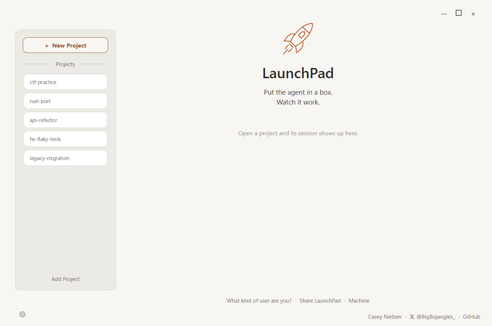
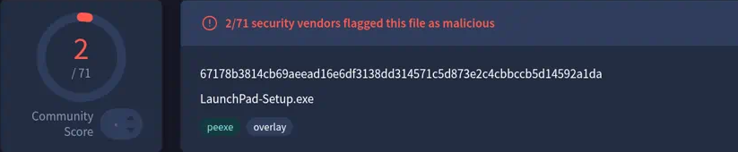
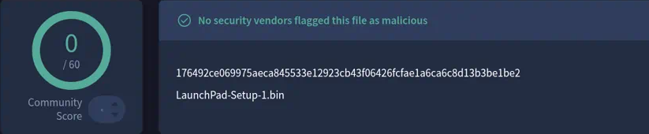
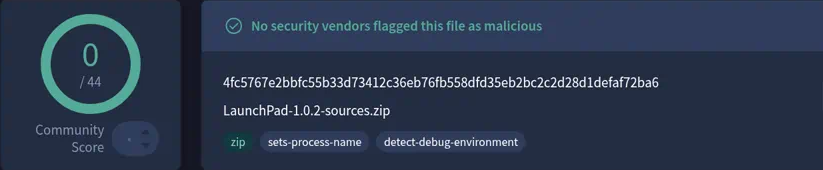

<p align="center">
  <picture>
    <source media="(prefers-color-scheme: dark)" srcset="docs/launchpad-header-dark.png">
    
  </picture>
</p>

<p align="center">
  
  
  
</p>

<p align="center">
  <a href="https://github.com/BigBojangles/LaunchPad/releases/latest"></a>
</p>

<p align="center">
  
</p>

LaunchPad is a Windows desktop app that opens a coding-agent project in a persistent Linux VM, with clear agent controls, each with its own color and icon. It is built for Grok Build, Codex CLI, Claude Code, and custom programs.

**Status:** POC/MVP Windows beta, released October 9, 2026. The build is unsigned. QEMU is the proof-of-concept VM engine; OpenVMM is the planned engine. The boundary pieces are being rewritten in Rust. The UI stays C#.

This is an early beta. What's proven, what's tested in parts, and what's untested are kept separate on purpose.

## Three versions

- **Full app:** available now.
- **CLI:** coming soon.
- **Native-only package:** coming later. Inside the full app, Native is an option, never the default. It runs the agent on Windows with no VM fence.

## Defaults

Defaults lean safe and leave you in control. Each one says what was picked and why. Known limits below lists where it isn't safe yet.

## What it does

1. Open a project.
2. Run it in a fenced Linux VM, or open native if you choose that path.
3. Work in agent terminals aimed at Grok Build, Codex CLI, Claude Code, or Custom.
4. Send selected files into the VM, then return changed files to Windows.

## What's proven

Four backend tests pass:

- The VM boots directly.
- Imported files arrive intact.
- Typing reaches the agent.
- Shutting down and reopening keeps your work.

Startup took about 6 seconds in local backend tests. In total, 7 of 92 features are proven, all backend.

## Tested in parts

- **Copy-back verification** is built, but only tested on sample files.
- **AMSI scan on the way back:** returned files go through the Windows AMSI scan, and copy-back refuses to apply if the scan is unavailable or rejects content. This is not a guarantee that files are malware-free.
- **Agent support:** Grok Build, Codex CLI, and Claude Code are partly tested. Codex has an open sandbox conflict.

## Untested

- The real GUI, including all 14 UI features.
- The installer on a clean PC.
- **Snapshot push:** before returned files update your Windows project folder, LaunchPad can push a snapshot commit to a git remote you choose. It backs up the host project folder only, not the VM session disk.
- **The pager:** notifications are built, but phone delivery isn't proven.

## Known limits

- **Remove tokens from `.git/config` before opening a repo in a VM.** The first open copies the whole `.git` folder into the VM, including other remotes, `pushurl`, `http.extraHeader`, and credential settings. Only `origin`'s URL gets swapped, and only after it's already on the VM disk. Your global Git settings and Windows Credential Manager are not copied. Commits made in the VM don't come back to Windows.
- Native mode is unfenced.
- Import can follow links that point outside the project.
- Custom programs skip the AppArmor policy and may lack activity telemetry.
- Strict mode refuses to start if network blocking can't be enforced.
- The saved agent login inside the VM isn't encrypted.
- The VM control ports have no password. They listen on loopback only.
- Host-network isolation is incomplete.
- If Windows Hypervisor Platform is off, a VM start fails with an engine error instead of a clear message. Run **Settings → Repair setup**.
- RAM and CPU allocations are not proof of an overall hard resource cap.
- File-access checks have been scoped, not exhaustive.
- No built-in chat service, code editor, scheduled backup, or general auto-update.

## Coming soon

"Announced" is the first mention in this README. "Code saved" is the first time the code went into git (≈ means part of a big checkpoint). Saved code isn't proven code.

| Feature | State | Announced | Code saved |
|---|---|---|---|
| The pager (notifications) | Built; phone delivery not proven | Oct 6, 2026 | ≈ Oct 7, 2026 |
| Activity lights | Work only with a stand-in so far | Oct 6, 2026 | ≈ Oct 7, 2026 |
| Windows test bridge | Switched off in this release | Oct 6, 2026 | ≈ Oct 7, 2026 |
| User-facing CLI | Planned | Oct 6, 2026 | — |
| Security-preset slider | Planned | Oct 6, 2026 | — |
| OpenVMM engine | Planned | Oct 8, 2026 | — |
| Rust rewrite of the boundary pieces | In progress | Oct 8, 2026 | — |
| Apple Silicon Mac release | After the Windows beta | Oct 6, 2026 | — |

## Install the beta

**Download:** https://github.com/BigBojangles/LaunchPad/releases/latest

**Download all of these files into the same folder.** The installer is split into parts. If you download only the `.exe`, setup fails.

| File | What it is | Size |
|---|---|---:|
| `LaunchPad-Setup.exe` | The installer you run | 2.2 MB |
| `LaunchPad-Setup-1.bin` | Installer part 1 | 598 MB |
| `LaunchPad-Setup-2.bin` | Installer part 2 | 600 MB |
| `LaunchPad-Setup-3.bin` | Installer part 3 | 93 MB |
| `LaunchPad-Full-SHA256.txt` | Hashes to check the download | 1 KB |

About 1.3 GB total. Most of that is the Debian 12 Linux VM image your agent runs in, plus the QEMU engine that runs it. The LaunchPad app itself is small.

1. Open the download link above and download every file in the table into one folder. Don't rename them.
2. Open PowerShell in that folder and check the hashes:
   ```powershell
   Get-FileHash .\LaunchPad-Setup.exe, .\LaunchPad-Setup-*.bin -Algorithm SHA256
   ```
   Each result must match the line for that file in `LaunchPad-Full-SHA256.txt`.

   Every file is also scanned on VirusTotal. See [VirusTotal scans](#virustotal-scans) below.
3. The build is unsigned, so Windows SmartScreen will say "Windows protected your PC." Click **More info**, then **Run anyway**, but only after the hashes match.
4. If Windows Hypervisor Platform is off, setup asks for administrator approval, turns it on, and creates a standard (non-admin) Windows account named `BuildLaunchTest`.

Setup doesn't handle these:

- **Firmware virtualization.** Intel VT-x or AMD SVM has to be on in your BIOS/UEFI settings.
- **Restart.** If setup turned on the hypervisor, restart Windows before your first VM project.
- **Native agents.** Native mode uses Grok Build, Codex CLI, or Claude Code already installed on Windows. Install and sign in to them yourself.

### Did it work? (untested)

**It worked if LaunchPad opens to the home screen with the rocket and "Open a project and its session shows up here."**

- LaunchPad installs to `%LOCALAPPDATA%\Programs\LaunchPad`. The shortcut boxes in setup are unticked by default.
- First launch asks **"What kind of user are you?"** before the home screen.
- On your first VM start, the status goes **"Warming up the engines"** → **"VM is launching"** → **"Blast off!"** when the agent terminal opens. Your agent may ask you to sign in.
- If you see "The fenced VM runtime is not installed or is incomplete," go to **Settings → Repair setup**.

## VirusTotal scans

Click a card to open the full report. Each hash matches `LaunchPad-Full-SHA256.txt`.

### `LaunchPad-Setup.exe`: 2/71

[](https://www.virustotal.com/gui/file/67178b3814cb69aeead16e6df3138dd314571c5d873e2c4cbbccb5d14592a1da)

SHA256: `67178b3814cb69aeead16e6df3138dd314571c5d873e2c4cbbccb5d14592a1da`

Two generic flags, not named malware: Skyhigh (BehavesLike.Win32.ObfuscatedPoly) and Trapmine (Suspicious.low.ml.score). Heuristic and machine-learning flags like these are common for unsigned Inno Setup installers.

### `LaunchPad-Setup-1.bin`: 0/60 (clean)

[](https://www.virustotal.com/gui/file/176492ce069975aeca845533e12923cb43f06426fcfae1a6ca6c8d13b3be1be2)

SHA256: `176492ce069975aeca845533e12923cb43f06426fcfae1a6ca6c8d13b3be1be2`

### `LaunchPad-Setup-2.bin`: 0/59 (clean)

[](https://www.virustotal.com/gui/file/4763dd6a3f42ff633f6f77c8f1d49678eb0d799f3138172b761bd63fcb941545)

SHA256: `4763dd6a3f42ff633f6f77c8f1d49678eb0d799f3138172b761bd63fcb941545`

### `LaunchPad-Setup-3.bin`: 0/61 (clean)

[](https://www.virustotal.com/gui/file/b257328b30deef9d7f5ca92e3a3e1fec2f80f91fee77994ae3a261fa058c7090)

SHA256: `b257328b30deef9d7f5ca92e3a3e1fec2f80f91fee77994ae3a261fa058c7090`

### `LaunchPad-1.0.2-sources.zip`: 0/44 (clean)

[](https://www.virustotal.com/gui/file/4fc5767e2bbfc55b33d73412c36eb76fb558dfd35eb2bc2c2d28d1defaf72ba6)

SHA256: `4fc5767e2bbfc55b33d73412c36eb76fb558dfd35eb2bc2c2d28d1defaf72ba6`

All files are unsigned. If Windows shows "Windows protected your PC," click **More info**, then **Run anyway**.

## Try it from source

Needs Windows, the .NET 8 SDK selected by `global.json`, and Python 3 (each build runs `py -3 scripts/verify-source-privacy.py`).

```powershell
dotnet restore LaunchPad.sln --locked-mode
dotnet build LaunchPad.sln --no-restore
dotnet test tests/LaunchPad.Tests/LaunchPad.Tests.csproj --no-restore --filter "Category!=Integration"
```

The patched QEMU runtime, guest images, and session disks are not in this repository. Use `LaunchPad-1.0.2-sources.zip` on the release for the exact runtime source.

## Credit

Built by Casey Nielsen · X [@BigBojangles_](https://x.com/BigBojangles_) · [github.com/BigBojangles](https://github.com/BigBojangles)

## License

LaunchPad source is under the MIT License. Third-party components keep their own licenses:

- **QEMU** is GPLv2 and modified (dev 11.1.50 plus console-size patches). Its exact source is in `LaunchPad-1.0.2-sources.zip` on the release.
- **LGPL DLLs** (GLib, libiconv, and libintl, shipped beside QEMU): their sources are in the same archive, `LaunchPad-1.0.2-sources.zip`.

See NOTICE.

LaunchPad is not affiliated with or endorsed by xAI, OpenAI, or Anthropic. Grok and Grok Build are trademarks of xAI. Codex is a trademark of OpenAI. Claude and Claude Code are trademarks of Anthropic.
